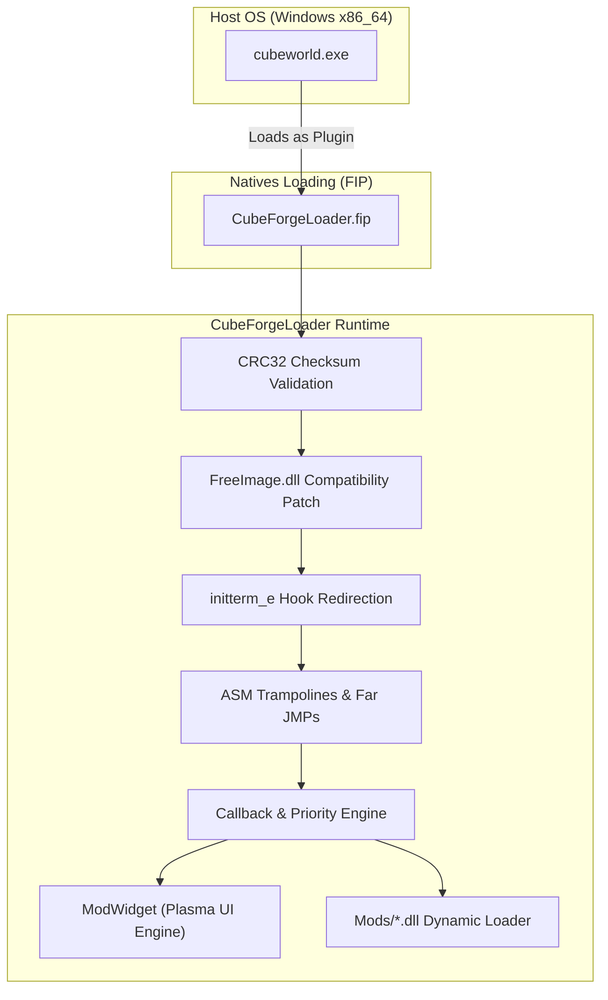
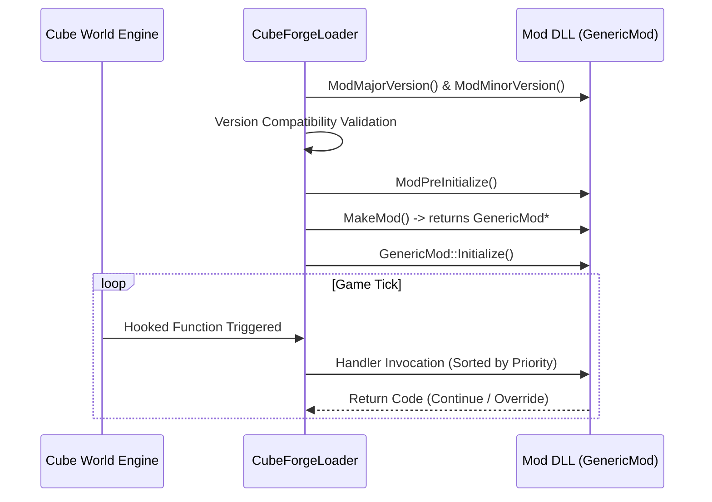

# Architecture & Technical Design

## 1. Overview

`cubeforge.loader` is a modern, lightweight modding framework and runtime hook engine for *Cube World* (Steam release, version `1.0.0-1`, x86_64). It is loaded natively as a plugin (`CubeForgeLoader.fip`) by the game's executable. It verifies executable integrity, hooks internal engine entry points via x86_64 assembly trampolines, mounts an in-game mod management GUI widget, and orchestrates the lifecycle of dynamic mod libraries (`.dll`).



---

## 2. Subsystem Details

### 2.1 CubeForgeLoader (Runtime Hook Engine)

* **Source Files**: [`main.cpp`](../src/main.cpp), [`macros.h`](../src/macros.h), [`crc.cpp`](../src/crc.cpp), [`DLL.cpp`](../src/DLL.cpp), [`ModWidget.cpp`](../src/ModWidget.cpp)

#### A. Entry Point & Self-Preservation (`DllMain`)
When attached (`DLL_PROCESS_ATTACH`), the loader performs:
- **Module Lock**: Prevents multiple initializations via a mutex (`already_initialized_mtx`).
- **Handle Pinning**: Calls `LoadLibrary("CubeForgeLoader.fip")` to prevent unloading when loaded as a plugin.
- **Interactive Prompt**: If executed as a `.fip` extension, prompts the user via `MessageBoxA` to confirm mod execution.
- **Binary Integrity Verification**: Computes the CRC32 of `cubeworld.exe` against known checksums:
  - Packed executable (SteamStub DRM): `0xC7682619`
  - Unpacked executable: `0xBA092543`
- **FreeImage Patch**: Overwrites instructions in `FreeImage.dll` (`0x1E8C4E` and `0x1E8C62`) with `0x90` (`NOP`) instructions to resolve a known memory/rendering crash on Windows 8, 10, and 11.

#### B. Early Initialization Hijacking (`initterm_e`)
Rather than patching the PE entry point directly, the loader redirects `initterm_e` at base offset `0x42CBD8`:
- Replaces the `initterm_e` function pointer with a pointer to `ASMStartMods`.
- `ASMStartMods` prepares the CPU stack, preserves registers (`PUSH_ALL`), calls `StartMods()`, restores registers (`POP_ALL`), and jumps to the original `initterm_e` function via dereferenced jump (`DEREF_JMP`).

```text
[cubeworld.exe Startup]
         │
         ▼
[CRT Startup / initterm_e call]
         │ (Redirected Function Pointer at 0x42CBD8)
         ▼
[ASMStartMods (Naked Assembly Trampoline)]
         │──> PUSH_ALL & PREPARE_STACK
         │──> call StartMods()
         │        ├── SetupHandlers() [Hook Engine Points]
         │        ├── Find & Load DLLs in "Mods/*.dll"
         │        ├── Validate Mod Versions (Major/Minor)
         │        ├── Load/Apply mod settings (mods-settings.cwb)
         │        └── Call ModPreInitialize() and GenericMod::Initialize()
         │──> RESTORE_STACK & POP_ALL
         │──> DEREF_JMP(initterm_e) [Resume original game CRT init]
```

---

## 3. Hooking & Trampoline Architecture

The loader uses 64-bit absolute indirect jumps (`WriteFarJMP`) and GCC naked functions defined in [`macros.h`](../src/macros.h).

### Far Jump Encoding
To jump anywhere within the 64-bit address space without RIP-relative limit restrictions:
```text
Opcode:       FF 25 00 00 00 00  (JMP QWORD PTR [rip + 0])
Address (8B): [ 64-bit Target Virtual Address ]
Total size:   14 bytes
```

### Handler Categories
The engine hooks dozens of game engine functions organized by domain:

| Domain | File Location | Hooked Operations / Target |
| :--- | :--- | :--- |
| **GUI** | `callbacks/gui/` | `StartMenuWidget::Draw`, `CharacterPreviewWidget::Draw`, `GUI::Load` |
| **Game Loop** | `callbacks/game/` | `Game::Update`, `Game::MouseUp`, `GameTick` |
| **Creature** | `callbacks/creature/` | `GetArmor`, `CanEquipItem`, `OnCreatureDeath`, Combat/Drown/Fall Death |
| **Stats Calc** | `callbacks/` | HP, Critical, Attack Power, Spell Power, Haste, Resistance, Regen, Mana Gen |
| **World** | `callbacks/world/` | Chunk Remesh, Chunk Remeshed, Zone Generated, Zone Destroyed |
| **Items / Economy**| `callbacks/item/` | Buying Price, Selling Price, Gold Bag Value, Class Can Wear Item |
| **Input / System** | `callbacks/` | `WindowProc`, `GetKeyboardState`, `GetMouseState`, `Present` (DirectX/DXGI) |
| **Network** | `callbacks/` | `ChatHandler`, `P2PRequestHandler` |

---

## 4. In-Game Mod UI (`ModWidget`)

* **Source Files**: [`ModWidget.h`](../src/ModWidget.h), [`ModWidget.cpp`](../src/ModWidget.cpp)
* **Engine Integration**: Subclasses `cube::BaseWidget` in the game's proprietary Plasma rendering engine.
* **Features**:
  - Injected directly into the start menu (`cube__StartMenuWidget__Draw`).
  - Displays mod list with pagination (7 mods per page).
  - Toggles mod states dynamically.
  - Serializes mod activation state into binary config `mods-settings.cwb`.
  - Automatically restarts `cubeworld.exe` via `_execvp` if modifications require a restart.

---

## 5. Mod Execution Model & Lifecycle

Mods built for `CubeForgeLoader` export specific C-ABI functions and inherit from `GenericMod`:



### Handler Priority System
Each callback on `GenericMod` includes an execution priority:
1. `VeryHighPriority (0)`
2. `HighPriority (1)`
3. `NormalPriority (2)` (Default)
4. `LowPriority (3)`
5. `VeryLowPriority (4)`
